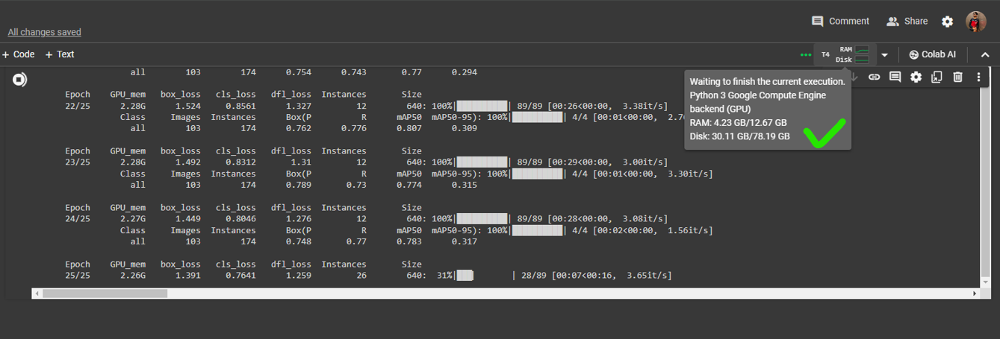

- Watch the [demo](https://www.youtube.com/watch?v=5pTEcX3orbA) (WIP)

- Training dataset was taken from [Roboflow](https://universe.roboflow.com/kwan-li-jqief/valorant-object-detection2/dataset/7).

- Model training was done on [Google Colab](https://colab.research.google.com/drive/1cBZeH4pfT-m1Rjg-jyPPQWEjopjDNP9R?usp=sharing).  
  The teeny-tiny 6MB model requires 4GB of RAM for training but cannot be trained on 8GB Windows powered machine as Windows itself uses 9 out of 8GB :)  
  
